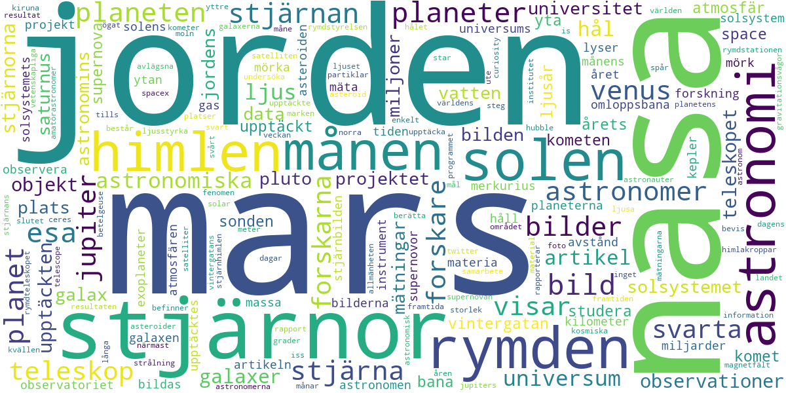

# Astronomy words

To prepare for a presentation for my course in Swedish langugage, I read some articles on https://www.popularastronomi.se/.
That made me wondering which words (related to astronomy) appear often in the articles.

I used `BeautifulSoup` to web-scrape the site for articles in the last ten years, and `WordCloud` to produce nice images as the one below. There, the size of the font of each word corresponds to the frequency of the word in the articles.
Check out the notebook `astronomy_words.ipynb`

